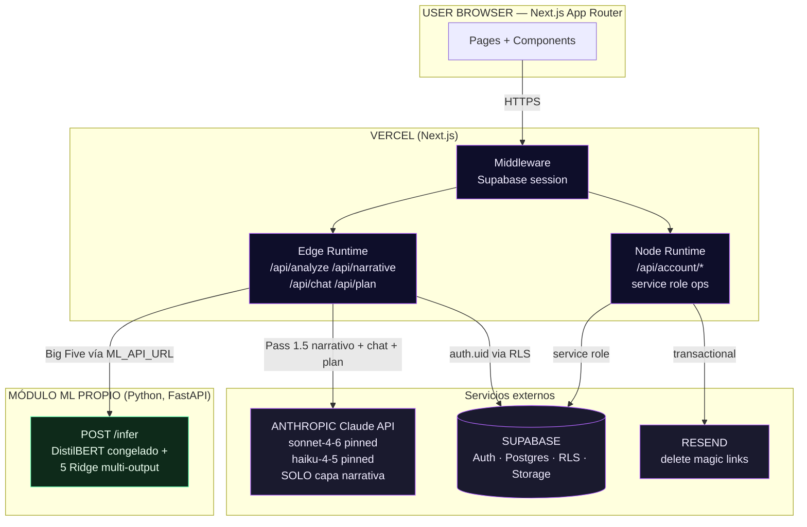

# Umbra — Architecture Deep Dive (post-pivot ML, 2026-04-27)

> System architecture, component topology, dependency graph, and production
> failure scenarios.
>
> **Banner pivot ML (ADR-002 v2 + ADR-026)**: el componente analítico
> (Big Five) corre como **módulo Python independiente** en `/ml/`,
> servido por FastAPI. El frontend Next.js lo consume vía HTTP usando
> `process.env.ML_API_URL`. Vercel solo expone Next.js; el módulo ML
> corre en `localhost:8000` durante desarrollo y en Render/Fly.io en
> producción opcional. Capa Claude se reserva para narrativa,
> interpretación Jung+arquetipo, plan, chat y crisis classifier.

## High-level topology



ASCII fallback (for environments that do not render Mermaid):

```
                            ┌─────────────────────────┐
                            │      USER BROWSER       │
                            │   (Next.js App Router)  │
                            └─────────────┬───────────┘
                                          │ HTTPS
                                          ▼
                        ┌─────────────────────────────────┐
                        │           VERCEL                │
                        │   ┌────────────┐   ┌─────────┐  │
                        │   │Edge Runtime│   │  Node   │  │
                        │   │(Claude rts)│   │(account)│  │
                        │   └─────┬──────┘   └────┬────┘  │
                        │         │               │       │
                        │   ┌─────┴───────────────┴────┐  │
                        │   │   Next.js middleware     │  │
                        │   │   (Supabase session)     │  │
                        │   └──────────────────────────┘  │
                        └────────┬────────────────────────┘
                                 │
              ┌──────────────────┼───────────────────┐
              │                  │                   │
              ▼                  ▼                   ▼
       ┌──────────┐       ┌──────────────┐    ┌─────────────┐
       │ SUPABASE │       │  ANTHROPIC   │    │   RESEND    │
       │──────────│       │  Claude API  │    │    Email    │
       │ Auth     │       │──────────────│    │─────────────│
       │ Postgres │       │ sonnet-4-6   │    │ delete      │
       │ + RLS    │       │ haiku-4-5    │    │ magic links │
       │ Storage  │       │ (pinned SKU) │    │             │
       └──────────┘       └──────────────┘    └─────────────┘
```

## Component inventory

### Frontend (`app/`)
- **Public routes**: `/`, `/(auth)/login`, `/(auth)/register`, `/privacy`, `/terms`
- **Gated routes**: `/consent`, `/onboarding`, `/dashboard`, `/chat`, `/plan`, `/export`, `/settings/*`
- **Layout shell**: `app/layout.tsx` with cosmic background (3 orbs, noise texture, fonts) and providers (Auth, Theme)
- **Middleware**: `middleware.ts` at root — Supabase session cookie refresh, auth redirects per [tech/AUTH.md](AUTH.md)

### Backend (`app/api/`)
- **Edge runtime**: `/api/analyze`, `/api/analyze/evidence`, `/api/narrative`, `/api/chat`, `/api/plan` — Claude-calling routes, streaming via SSE, latency-sensitive
- **Node runtime**: `/api/account/*` — service-role operations, cascade deletes, email sending
- **Response envelope**: consistent `{ ok, data }` or `{ ok, error, ... }` via `lib/api/with-error-handler.ts`

### Shared code (`lib/`)
- `lib/supabase/{client,server,edge,middleware}.ts` — split per runtime
- `lib/claude/{client,pricing}.ts` — SDK wrapper + token→USD conversion
- `lib/knowledge/{big-five,jung-functions,archetypes,positive-computing,build-block}.ts`
- `lib/prompts/{analyze-profile,analyze-evidence,generate-narrative,chat-context,crisis-classifier,development-plan}.ts`
- `lib/evals/{cases,run,consistency,cross-model-paraphrase}.ts`
- `lib/chat/{crisis-lexicon,classifier,pipeline}.ts`
- `lib/security/peppers.ts`
- `lib/errors.ts` — typed error classes
- `lib/api/with-error-handler.ts` — response envelope wrapper
- `lib/store/{profile,onboarding,chat}.ts` — Zustand stores (one per domain)
- `lib/providers/{auth-context,theme}.tsx`

### Types (`types/`)
- `types/index.ts` — central types file (CLAUDE.md rule: no inline types)

### Database (`supabase/migrations/`)
- `001_initial_schema.sql` (Phase 1) — 6 tables with RLS
- `002_core_tables.sql` (Phase 1.5.6) — 7 new tables + 2 forward-compat columns + `charge_rate_limit` + `reconcile_rate_limit` RPCs

## Dependency graph

```
app/
├── layout.tsx
│   ├── lib/providers/auth-context
│   │   └── lib/supabase/client
│   └── lib/providers/theme
│
├── api/analyze/route.ts
│   ├── lib/api/with-error-handler
│   │   └── lib/errors
│   ├── lib/supabase/edge
│   ├── lib/claude/client
│   │   └── lib/claude/pricing
│   ├── lib/prompts/analyze-profile
│   │   └── lib/knowledge/* (all 4 + build-block)
│   └── lib/security/peppers
│
├── api/chat/route.ts
│   ├── lib/api/with-error-handler
│   ├── lib/supabase/edge
│   ├── lib/chat/pipeline
│   │   ├── lib/chat/crisis-lexicon
│   │   ├── lib/chat/classifier
│   │   │   └── lib/prompts/crisis-classifier
│   │   └── lib/claude/client
│   └── lib/security/peppers
│
└── api/account/delete/confirm/route.ts (Node)
    ├── lib/api/with-error-handler
    ├── lib/supabase/server (service role)
    └── lib/security/peppers
```

Max dependency depth: 3 levels. No circular imports. Every file has a single
clear responsibility.

## Component boundaries

- **`lib/knowledge/`** — pure data + build helper. NO side effects, NO API calls, NO database.
- **`lib/prompts/`** — pure functions that build prompt strings. NO side effects. NO Claude calls (that's `lib/claude/`).
- **`lib/claude/client.ts`** — the ONLY file that calls Anthropic SDK. Every API route imports from here.
- **`lib/evals/`** — test-time only. Never imported by app code.
- **`lib/chat/`** — safety pipeline. Self-contained, testable without DB.
- **`app/api/*/route.ts`** — thin orchestration. Calls `lib` helpers, no business logic inline.

## Data flow (end-to-end analyze)

```
┌─────────────┐
│ User text   │ (from client, POST /api/analyze)
└──────┬──────┘
       │
       ▼
┌─────────────────────────────┐
│ withErrorHandler wrapper    │
│  catches ZodError → 400     │
│  catches RateLimitError→429 │
│  catches ClaudeError → 503  │
└──────┬──────────────────────┘
       │
       ▼
┌─────────────────────────┐
│ zod parse input         │
└──────┬──────────────────┘
       │
       ▼
┌─────────────────────────────────────┐
│ Supabase edge client                │
│ supabase.auth.getSession()          │
│ verify consent_records row exists   │
└──────┬──────────────────────────────┘
       │
       ▼
┌─────────────────────────────────────┐
│ RPC charge_rate_limit(...)          │
│ atomic check + charge               │
│ returns {allowed, remaining}        │
└──────┬──────────────────────────────┘
       │
       ├── allowed=false ──▶ throw RateLimitError ──▶ 429
       │
       ▼
┌─────────────────────────────────────┐
│ lib/prompts/analyze-profile         │
│ buildAnalyzeProfilePrompt()         │
│ injects all 4 KB blocks             │
└──────┬──────────────────────────────┘
       │
       ▼
┌─────────────────────────────────────┐
│ lib/claude/client.ts                │
│ claudeText({ system, prompt, ... }) │
│ temperature=0, JSON mode            │
│ PINNED model SKU from env           │
└──────┬──────────────────────────────┘
       │
       ├── timeout ──▶ retry 2x ──▶ throw ClaudeError
       ├── malformed JSON ──▶ retry 1x ──▶ throw ClaudeError
       │
       ▼
┌─────────────────────────────────────┐
│ Zod parse Claude response           │
│ clamp out-of-range scores           │
└──────┬──────────────────────────────┘
       │
       ▼                                    ┌──────────────────────┐
┌──────┴──────────┐                         │ (parallel Promise)   │
│ Promise.all([   │                         │                      │
│   Pass2 fetch,  │ ─────────────────────▶ │ Pass 2 (Edge route)  │
│   DB insert     │                         │ analyze-evidence     │
│ ])              │                         │ temperature=0.3      │
└──────┬──────────┘                         └──────────┬───────────┘
       │                                               │
       │                                               ▼
       │                                    ┌──────────────────────┐
       │                                    │ INSERT evidence_     │
       │                                    │ highlights           │
       │                                    └──────────────────────┘
       │
       ▼
┌─────────────────────────────────────┐
│ INSERT psychological_profiles       │
│ (version=1, user_id, profile fields)│
└──────┬──────────────────────────────┘
       │
       ├── if research_opt_in=true ──▶ INSERT research_dataset (HMAC)
       │
       ▼
┌─────────────────────────────────────┐
│ UPDATE profiles                     │
│ SET onboarding_completed = true     │
└──────┬──────────────────────────────┘
       │
       ▼
┌─────────────────────────────────────┐
│ finally: reconcile_rate_limit       │
│ (regardless of success/error)       │
└──────┬──────────────────────────────┘
       │
       ▼
┌─────────────────────────────────────┐
│ Response.json({ ok:true, data })    │
│ via withErrorHandler                │
└─────────────────────────────────────┘
```

## Scaling characteristics

| Surface | TFG scale (~500 users/mo) | Breaks at |
|---|---|---|
| Vercel Hobby | ✓ free | 100 GB/mo bandwidth |
| Supabase Free | ✓ free | 500 MB DB, 2 GB bandwidth, 50k MAU |
| Claude costs | $10-30/mo | `GLOBAL_DAILY_BUDGET_USD` cap |
| Resend Free | ✓ free | 100 emails/day |
| Edge runtime 60s | ✓ | narrative stream > 60s |
| RLS performance | ✓ | joins across >3 RLS tables (not a concern here) |

**First bottleneck at scale**: Claude cost. Every analyze is ~$0.04. At 10k
users/month with 1 analyze each = $400/month. TFG-scale is safe.

## SPOF (single points of failure)

| SPOF | Impact | Mitigation |
|---|---|---|
| Supabase down | Full app down | Vercel serves maintenance page via Edge Config (TODO) |
| Anthropic API down | All Claude routes 503 | Graceful degradation: show maintenance banner, disable affected routes |
| Vercel platform down | Full app down | (nothing to do — Vercel is the platform) |
| `GLOBAL_DAILY_BUDGET_USD` hit | Claude routes 503 | Intentional circuit breaker, manual override via env var |
| Resend down | Delete magic links fail | User sees error, can retry; alternative: SMS (not in scope) |
| Domain DNS | Full app unreachable | Vercel's DNS is reliable enough for TFG |

## Security architecture

See [tech/SECURITY.md](SECURITY.md) for deep dive. Summary:

- **Auth**: Supabase Auth with email+password. Sessions in cookies via `@supabase/ssr`.
- **Access control**: RLS on every table. `auth.uid() = user_id` or service_role only.
- **Data integrity**: Zod at every API boundary. Typed error classes. No inline validation.
- **Peppers**: 4 × 32-byte HMAC secrets in env. Version-pinned for rotation.
- **Crisis safety**: regex pre-filter + Claude classifier (fail-closed) + hard-coded resource routing.
- **Rate limiting**: atomic `charge_rate_limit` RPC. Token + cost caps. Global budget ceiling.
- **Input sanitization**: 2000-char cap, UTF-8 only, log suspicious patterns.
- **SQL injection**: Supabase parameterizes all queries. RPCs use SECURITY DEFINER with `SET search_path`.
- **XSS**: React escapes by default. No `dangerouslySetInnerHTML`.
- **CSRF**: Supabase Auth uses SameSite=Lax cookies + JWT. Mutations require auth.
- **Secrets**: no keys in client code. Vercel env vars server-only.

## Production failure scenarios

### Scenario 1: Claude API intermittent 503s
- **Detection**: error rate > 5% for 5min
- **Mitigation**: retry with backoff (2x, 4x seconds); after 2 retries, throw `ClaudeError` → 503 to user
- **User experience**: "servicio no disponible temporalmente, reintentá en un momento"

### Scenario 2: Supabase connection pool exhausted
- **Detection**: `PostgrestError` with connection error
- **Mitigation**: Edge routes don't hold persistent connections (short-lived). Supabase handles pooling automatically.
- **User experience**: generic 500 → retry

### Scenario 3: Classifier returns unparseable JSON
- **Detection**: `JSON.parse` throws in `lib/chat/classifier.ts`
- **Mitigation**: fail-closed → throw `ClassifierFailure` → catch in route → return 451 crisis with "no pudimos verificar" note
- **Log**: `crisis_events` with `severity='classifier_error'`
- **User experience**: crisis card shown (false positive is the safe direction)

### Scenario 4: Double-submit onboarding
- **Detection**: 2 requests with same user_id
- **Mitigation**: `UNIQUE(user_id, version)` on `psychological_profiles`; second INSERT hits conflict; route catches and returns the existing profile
- **User experience**: both requests resolve with the same profile (idempotent)

### Scenario 5: User navigates away mid-analyze
- **Detection**: client `AbortController` fires
- **Mitigation**: Edge route continues but response is ignored. `finally` block runs reconcile. Profile still gets written.
- **User experience**: if user comes back, their profile is ready in the dashboard

### Scenario 6: SSE stream drops mid-narrative
- **Detection**: client EventSource `onerror`
- **Mitigation**: server buffers progress; client can retry with `regenerate=false` to pick up from where it left off (if implemented) or retry from scratch
- **User experience**: "se interrumpió, probá de nuevo" with retry button

### Scenario 7: Crisis false negative (lexicon misses)
- **Detection**: user reports or manual review of `crisis_events`
- **Mitigation**: hotfix the lexicon with the missed pattern; ship immediately; bump `LEXICON_VERSION`
- **Post-mortem**: document in `docs/tech/INCIDENTS.md` (create when needed)

## Rollback posture

- **Code**: Vercel Dashboard → previous deployment → "Promote to Production" (~1 min)
- **Migration**: every `NNN_name.sql` has a `NNN_name.down.sql` with explicit `DROP TABLE ... CASCADE;`
- **Model**: `ANTHROPIC_MODEL_ID` env var — change without code deploy
- **Prompts**: commit revert + code deploy (no data implications)
- **Knowledge base**: commit revert + code deploy. Evals may need re-run.

Rollback priority: code rollback is reversible in 1 min. Migration rollback
requires manual SQL run. DO NOT migrate forward without a tested down script.

## Observability stack

- **Logs**: `console.log` (structured JSON) → Vercel log aggregation
- **Metrics**: Vercel Analytics (traffic, Core Web Vitals)
- **DB metrics**: Supabase dashboard (query performance, storage)
- **Cost tracking**: custom SQL over `rate_limits.cost_usd_cents` per day
- **Alerts**: (TODO — Phase 7) email alerts on crisis_events high severity, global budget breach, error rate spike

See [tech/OBSERVABILITY.md](OBSERVABILITY.md).

## References

- [SYSTEM_SPEC.md](../SYSTEM_SPEC.md) — higher-level spec
- [DECISIONS.md](../DECISIONS.md) — 22 ADRs
- [tech/DATABASE.md](DATABASE.md) — schema details
- [tech/AUTH.md](AUTH.md) — Supabase SSR
- [tech/CHAT_SAFETY.md](CHAT_SAFETY.md) — crisis pipeline
- [tech/SECURITY.md](SECURITY.md) — peppers, RLS, threat model
- [tech/OBSERVABILITY.md](OBSERVABILITY.md) — logs, metrics, runbooks
