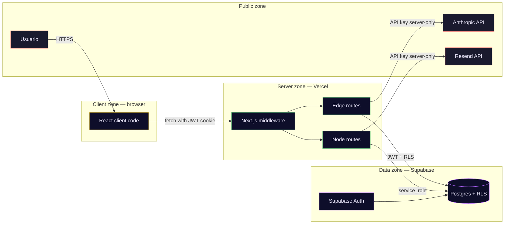

# Umbra — Threat model (STRIDE)

> Análisis de amenazas estructurado sobre la arquitectura de Umbra.
> Metodología STRIDE (Spoofing, Tampering, Repudiation, Information
> disclosure, Denial of service, Elevation of privilege) aplicada a
> cada componente. Este documento es input directo del capítulo de
> Seguridad de la tesis (TFG.md) y complementa
> [SECURITY.md](SECURITY.md) (implementación) y
> [CHAT_SAFETY.md](CHAT_SAFETY.md) (safety del chat).

## Por qué esto existe

Para un TFG de Ingeniería en Software que procesa **datos sensibles de
salud mental** bajo la Ley 25.326 de Argentina, tener un threat model
documentado antes de la defensa es la diferencia entre "hay seguridad
pensada" y "puedo probarlo con evidencia". El modelo también sirve de
checklist para verificar que las ADRs de seguridad (002, 003, 008, 013,
014, 017, 021, 022, 023, 024) cubren todas las superficies conocidas.

## Trust boundaries

## Assets (lo que hay que proteger)

| Asset | Confidencialidad | Integridad | Disponibilidad |
|---|---|---|---|
| Textos introspectivos del usuario | 🔴 Alta (datos sensibles art. 7 Ley 25.326) | 🟡 Media | 🟡 Media |
| Perfil psicológico (Big Five, Jung, arquetipo) | 🔴 Alta | 🔴 Alta (si se corrompe, el retrato es incorrecto) | 🟡 Media |
| Narrativa generada | 🔴 Alta | 🟡 Media | 🟢 Baja |
| Conversaciones de chat + crisis events | 🔴 Alta | 🔴 Alta (crisis_events es auditoría legal) | 🔴 Alta (downtime rompe safety) |
| Consent records | 🟡 Media | 🔴 Alta (immutable audit) | 🟢 Baja |
| Credenciales de auth (email + JWT) | 🔴 Alta | 🔴 Alta | 🔴 Alta |
| ANTHROPIC_API_KEY + peppers | 🔴 Alta | 🔴 Alta | N/A |
| Código fuente + ADRs | 🟢 Baja (open source) | 🔴 Alta | 🟡 Media |

## STRIDE per componente

### 1. Next.js middleware ([middleware.ts](../../middleware.ts))

| Threat | Risk | Mitigation | ADR |
|---|---|---|---|
| **S**poofing session cookies | Alta — acceso a cuenta ajena | Supabase SSR cookie signing; HTTPS-only; HttpOnly flag | ADR-003, ADR-004 |
| **T**ampering JWT payload | Alta | Supabase validates signature server-side | ADR-003 |
| **R**epudiation de login | Media | `consent_records` + IP hash audit trail | ADR-008, ADR-024 |
| **I**nformation disclosure via redirects | Baja | No leaking de internal paths en redirects | — |
| **D**oS via cookie flood | Baja — Vercel rate-limits | `charge_rate_limit` RPC per day | ADR-022 |
| **E**levation via bypass | Crítica si falla | Middleware corre en cada request; auth gates son default-deny | ADR-003 |

### 2. Edge routes — Claude-calling (`/api/analyze`, `/api/narrative`, `/api/chat`, `/api/plan`)

| Threat | Risk | Mitigation | ADR |
|---|---|---|---|
| **S**poofing de user_id | Alta | `supabase.auth.getUser()` obligatorio; RLS bloquea queries ajenas | ADR-003 |
| **T**ampering de prompts inyectados | Alta (prompt injection) | Zod valida input, system prompt inmutable, knowledge blocks firmados por hash | ADR-018 |
| **R**epudiation de análisis generado | Media | `analysis_raw` JSONB + `crisis_events` con salted hash | ADR-008 |
| **I**nformation disclosure via classifier fail-open | Crítica | Classifier es **fail-CLOSED** — errores → treat as crisis | ADR crisis pipeline |
| **D**oS via token budget exhaustion | Alta | `charge_rate_limit` pre-call + `reconcile_rate_limit` post-call | ADR-022 |
| **D**oS via global budget | Alta | `daily_cost_summary` view cached 5min, 503 sobre cap | ADR-016 |
| **E**levation via prompt injection → system prompt override | Media | Claude no ejecuta código arbitrario; prompts grounded en knowledge blocks | ADR-018 |

### 3. Node routes — `/api/account/*`

| Threat | Risk | Mitigation | ADR |
|---|---|---|---|
| **S**poofing para borrar cuenta ajena | Crítica | Delete flow requiere magic link con token TTL=5min + pepper signing | ADR-021 |
| **T**ampering del delete token | Alta | Token = HMAC-SHA256 con `DELETE_TOKEN_PEPPER_V1`, no adivinable | ADR-021 |
| **R**epudiation de borrado | Alta | `delete_confirmations` tabla con timestamp + pepper version | ADR-021 |
| **I**nformation disclosure via export | Media | Export solo datos propios via `auth.uid()`; research pseudonimizado | ADR-013 |
| **D**oS via email flood | Baja | Resend rate-limited; el flow requiere sesión autenticada previo | — |
| **E**levation via service_role leak | Crítica | `SUPABASE_SERVICE_ROLE_KEY` solo en env de Vercel Node runtime, nunca en código | ADR-003 |

### 4. Supabase Postgres + RLS

| Threat | Risk | Mitigation | ADR |
|---|---|---|---|
| **S**poofing via stolen JWT | Alta | JWT rotation + refresh + HTTPS-only | ADR-003, ADR-004 |
| **T**ampering via SQL injection | Alta | Supabase client usa prepared statements; no string concatenation en queries | — |
| **R**epudiation de escritura | Media | `created_at` + `updated_at` en cada tabla; consent_records immutable | ADR-024 |
| **I**nformation disclosure via RLS bypass | Crítica | RLS policy en todas las 13 tablas; `crisis_events`, `research_dataset`, `delete_confirmations` son service-role only | ADR-003, ADR-013 |
| **D**oS via query load | Media | Indexes en user_id, created_at; Supabase free tier tiene quota razonable para TFG | — |
| **E**levation via RLS gap | Crítica | CI test audita que toda tabla tenga ENABLE RLS + al menos una policy | TODO en IMPLEMENTATION_PLAN.md |

### 5. Anthropic API (Claude)

| Threat | Risk | Mitigation | ADR |
|---|---|---|---|
| **S**poofing del endpoint Claude | Baja | TLS verification en Anthropic SDK | — |
| **T**ampering del modelo (silent upgrade) | Alta (afecta reproducibilidad de la capa narrativa) | Identificador de modelo fijado vía `ANTHROPIC_MODEL_ID` | ADR-005 |
| **R**epudiation de request/response | Media | Logs estructurados + identificador de modelo persistido en cada perfil | ADR-005 |
| **I**nformation disclosure via training | Baja | Anthropic enterprise terms: no training on prompts | — |
| **D**oS por Anthropic API outage | Alta | Fallback path en conductor (open_text question) | ADR-022 |
| **E**levation vía prompt injection → Claude genera output malicioso | Media | Classifier fail-closed + ChatGPT seed parser con Zod validation + narrativa system prompt fijo | ADR-018 |

### 6. Client-side (browser)

| Threat | Risk | Mitigation | ADR |
|---|---|---|---|
| **S**poofing por otro sitio con cookies compartidas | Baja | SameSite=Lax default en Supabase | — |
| **T**ampering del DOM para saltar consent | Media | Server-side check en middleware: sin consent → redirect a `/consent` | ADR-024 |
| **R**epudiation de acciones del usuario | Baja | Server logs con IP hash | — |
| **I**nformation disclosure via XSS | Crítica | React escapes por default; no `dangerouslySetInnerHTML` en contenido del usuario; CSP headers via Vercel | — |
| **D**oS via client-side bundle bloat | Baja | Next.js tree-shake + dynamic imports para html2pdf.js | ADR-006 |
| **E**levation via `localStorage` de cookies de auth | N/A | Supabase SSR usa HttpOnly cookies, no accesibles desde JS | ADR-004 |

### 7. Crisis pipeline (`lib/chat/pipeline.ts`)

| Threat | Risk | Mitigation | ADR |
|---|---|---|---|
| **T**ampering de lexicon | Alta (false negatives peligrosos) | `LEXICON_VERSION` bumpeable; tests unitarios cubren cada pattern | CHAT_SAFETY.md |
| **I**nformation disclosure de crisis event | Alta | `crisis_events` guarda SOLO salted hashes (user_hash, message_hash); retención 30 días | ADR-008 |
| **D**enial de servicio al safety check | Crítica (false negative) | Pipeline es **fail-closed**: cualquier error → throw CrisisDetected | ADR-008, CHAT_SAFETY.md |
| **E**levation via idiom bypass | Media (false positive) | IDIOM_PRE_FILTER solo corta en frases específicas, no palabras sueltas | CHAT_SAFETY.md |

## Amenazas residuales conocidas (y por qué aceptamos el trade-off)

1. **Dependencia operativa del proveedor LLM externo** en la capa
   narrativa. Documentado como riesgo en TP1; mitigación con
   identificador de modelo fijado y capa de abstracción.
2. **Heterogeneidad EN/ES-AR** del corpus de entrenamiento del módulo
   analítico. Mitigación: reporte por dimensión Big Five con umbrales
   R²>0.20 y r>0.30 (ADR-027); las dimensiones que no alcancen el
   umbral se marcan `low_confidence` y se excluyen del componente
   cuantitativo del perfil.
3. **Sesgo del corpus latinoamericano** generado con asistencia IA.
   Mitigación documentada en ADR-028 (rúbrica manual + recomendación
   de validación cruzada con muestras humanas).
4. **n bajo en el estudio SUS** planificado para TP3/TP4. Mitigación:
   reporte honesto del n efectivo y apoyo en métricas ML, axe-core en
   CI, unit + E2E que son independientes del n de usuarios.

## Revisar este documento cuando

- Se agregue una tabla nueva a Supabase (evaluar RLS + STRIDE en sección 4).
- Se cambie el proveedor o el modelo de la capa narrativa (sección 5).
- Cualquier ADR nueva toque superficies de auth, crypto, o storage.
- Antes de cada release significativa.

## Referencias

- [OWASP STRIDE](https://owasp.org/www-community/Threat_Modeling_Process)
- [Microsoft STRIDE](https://learn.microsoft.com/en-us/previous-versions/commerce-server/ee823878(v=cs.20))
- [SECURITY.md](SECURITY.md) — implementación de peppers, HMAC, CSP.
- [CHAT_SAFETY.md](CHAT_SAFETY.md) — pipeline de crisis y evaluación.
- [DECISIONS.md](../DECISIONS.md) — Architecture Decision Records.
- [biz/LEGAL.md](../biz/LEGAL.md) — mapeo Ley 25.326.
- [biz/VALIDATION.md](../biz/VALIDATION.md) — plan de validación.
